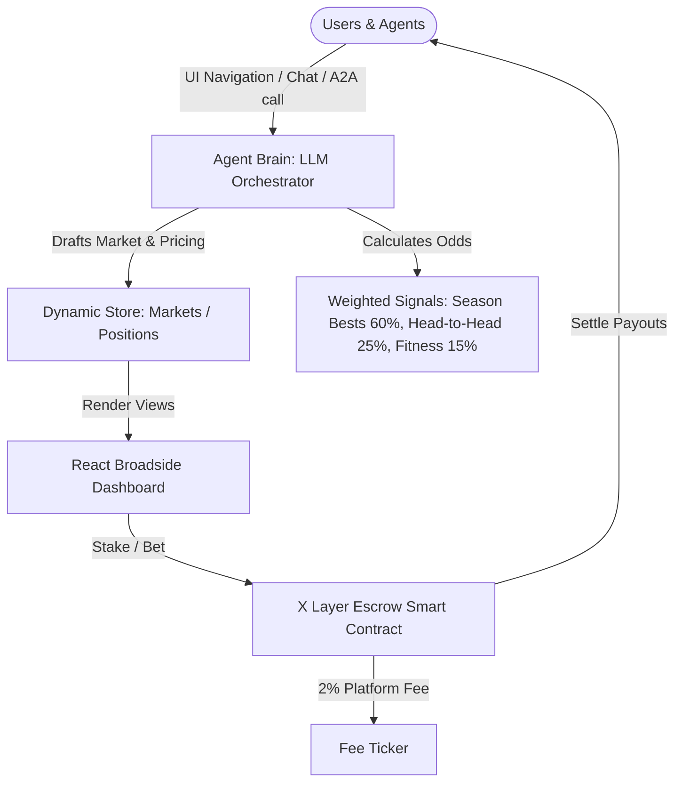

# GamesOracle AI
### An AI Prediction-Market Oracle Agent for the Glasgow 2026 Commonwealth Games
*Submitted to the OKX.AI Genesis Hackathon (Agent Service Provider track)*

---

## Executive Summary

**GamesOracle AI** is an Agent Service Provider (ASP) that turns the Glasgow 2026 Commonwealth Games schedule into structured, confidence-scored prediction markets. 

Built for the **Finance Copilot** and **Creative Genius** tracks on OKX.AI, this agent removes the "black box" of prediction markets. It provides explicit probability breakdowns, confidence scores, and structured reasoning before a market opens, and settles the outcomes automatically on-chain via X Layer when results post.

This repository hosts the **React Frontend Application**, bundled using **Parcel**. It serves as the primary dashboard, dispatch room, and ledger tracking interface for users and co-agents interacting with the GamesOracle ASP.

---

## Design & Aesthetics: "The Commonwealth Wire"

GamesOracle AI is styled like a classic **newspaper broadsheet**, merging vintage editorial design with modern predictive analytics:
* **Palette**: 
  * Vintage Newspaper Paper (`#F7F5F0`)
  * Editorial Dark Ink (`#111111`)
  * Headline Red (`#C81C1C`) for live wire tags and alerts.
  * Thistle Purple (`#9B6BFF`) to represent Scotland's national flower and highlight AI confidence analytics.
* **Typography**:
  * *Playfair Display* for classic newspaper mastheads and displaying odds.
  * *Source Serif 4* for deep-dive editorial dispatches and descriptions.
  * *IBM Plex Mono* for all data points, confidence indicators, and on-chain rails.
* **Signature Elements**:
  * **Confidence Rails**: Horizontal timing bars showing the AI's calculated probability side-by-side with the market's implied line, making mispriced arbitrage opportunities visible at a glance.

---

## Interactive Frontend Features

The React application implements the following dynamic flows:

1. **Cable to the Oracle (Markets Chat)**:
   * A natural language input field where users or agents can request customized markets (e.g., `"Create a market for the Nigeria medal bundle"` or `"Scotland velodrome dominance"`).
   * The AI agent parses the query, drafts a custom market, assigns confidence weightings, and **adds the new market dynamically to the live dashboard table**.
2. **Clip & Stake Coupon (Betting Flow)**:
   * Accessible by clicking any market row to navigate to its **Dispatch** page.
   * Features a clean, dashed-border betting coupon representing physical newspaper slips.
   * Placing a stake (5, 20, or 50 USDT on YES/NO) **instantly appends the position to your live on-chain Ledger**.
3. **Global Wallet Sync**:
   * One-click OKX Wallet connection simulation that persists connection state and address across all app pages.
4. **Live Fee Circulation Tracker**:
   * A dynamic ledger ticker counting up platform revenue collected in real-time, representing the 2% resolution fee collected on X Layer.

---

## System Architecture



---

## Smart Contract Sketch (X Layer Escrow)

The settlement layer uses a minimal escrow model on the EVM-compatible **X Layer**. A Solidity sketch of the contract managing lockups, resolution, and payouts is detailed below:

```solidity
// SPDX-License-Identifier: MIT
pragma solidity ^0.8.24;

import "@openzeppelin/contracts/security/ReentrancyGuard.sol";

contract GamesOracleEscrow is ReentrancyGuard {
    enum Status { Open, Resolved, Disputed }

    struct Market {
        string question;
        uint256 closeTime;
        Status status;
        bool outcome;          // true = YES wins
        uint256 yesPool;
        uint256 noPool;
        address oracle;        // agent's resolver address
    }

    mapping(bytes32 => Market) public markets;
    mapping(bytes32 => mapping(address => uint256)) public yesStakes;
    mapping(bytes32 => mapping(address => uint256)) public noStakes;

    modifier onlyOracle(bytes32 marketId) {
        require(msg.sender == markets[marketId].oracle, "not oracle");
        _;
    }

    function createMarket(bytes32 marketId, string calldata question, uint256 closeTime, address oracle) external {
        require(markets[marketId].closeTime == 0, "exists");
        markets[marketId] = Market(question, closeTime, Status.Open, false, 0, 0, oracle);
    }

    function stake(bytes32 marketId, bool yes) external payable nonReentrant {
        Market storage m = markets[marketId];
        require(m.status == Status.Open && block.timestamp < m.closeTime, "closed");
        if (yes) { yesStakes[marketId][msg.sender] += msg.value; m.yesPool += msg.value; }
        else     { noStakes[marketId][msg.sender]  += msg.value; m.noPool  += msg.value; }
    }

    function resolveMarket(bytes32 marketId, bool outcome) external onlyOracle(marketId) {
        Market storage m = markets[marketId];
        require(m.status == Status.Open, "already resolved");
        m.status = Status.Resolved;
        m.outcome = outcome;
    }

    function claimPayout(bytes32 marketId) external nonReentrant {
        Market storage m = markets[marketId];
        require(m.status == Status.Resolved, "not resolved");
        uint256 stakeAmt = m.outcome ? yesStakes[marketId][msg.sender] : noStakes[marketId][msg.sender];
        require(stakeAmt > 0, "nothing to claim");
        
        uint256 winningPool = m.outcome ? m.yesPool : m.noPool;
        uint256 totalPool = m.yesPool + m.noPool;
        uint256 fee = totalPool / 50; // 2% platform fee
        uint256 payout = (stakeAmt * (totalPool - fee)) / winningPool;
        
        if (m.outcome) yesStakes[marketId][msg.sender] = 0; else noStakes[marketId][msg.sender] = 0;
        payable(msg.sender).transfer(payout);
    }
}
```

---

## Getting Started (Local Development)

To run the React application locally:

### Prerequisites
Make sure you have [Node.js](https://nodejs.org/) installed.

### 1. Install Dependencies
Run the following command in the project root directory:
```bash
npm install
```

### 2. Run the Development Server
Launch the Parcel local environment:
```bash
npm start
```
By default, the server will launch on **`http://localhost:1234`**. Open this link in your browser to interact with the application.

### 3. Build for Production
To bundle and optimize the application for deployment:
```bash
npm run build
```
This outputs optimized, static assets into the `dist/` directory.

---

## ASP Registration Interface (Standardized Tools)

For OKX.AI integration, GamesOracle registers as an **Agent-to-MCP** service exposing the following standard endpoints:
* `get_markets(sport?, day?, status?)` -> Returns list of active and resolved prediction pools.
* `get_forecast(market_id)` -> Returns probability, confidence metrics, and structured textual reasoning.
* `create_market(question, sport, event, close_time)` -> Allows external agents to file new predictions.
* `get_portfolio(wallet_address)` -> Retrieves open positions and ledger history.